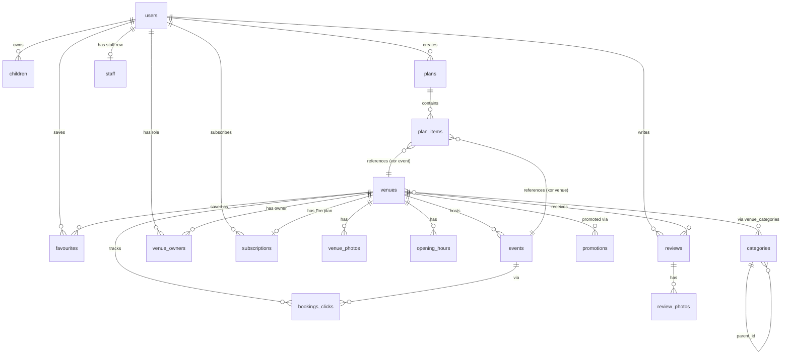

# Data Model

This file is the human-readable reference for the database schema. The
authoritative source is the SQL in [`supabase/migrations/`](../supabase/migrations/);
this document explains it.

The conceptual rationale (why these tables exist at all, how they support the
four monetisation streams, etc.) lives in [DESIGN.md §7](./DESIGN.md#7-data-model).

## Status

- Initial schema authored: [`supabase/migrations/0001_init.sql`](../supabase/migrations/0001_init.sql).
- Storage buckets are **not** created in SQL — set those up via the Supabase
  dashboard or `storage.buckets` API and document them here when added.
- TypeScript types are generated from the live database, not from this file:
  ```bash
  supabase gen types typescript --local > apps/mobile/types/database.ts
  ```

## How to update this doc

When the schema changes:

1. Add a new migration under `supabase/migrations/` (e.g. `0002_add_venue_amenities.sql`).
2. Update the affected section(s) in this file.
3. Regenerate types (command above).
4. Note breaking changes in the PR description and in the relevant session log.

## Extensions

| Extension | Purpose |
|---|---|
| `pgcrypto` | `gen_random_uuid()` for UUID primary keys. |
| `citext` | Case-insensitive text for emails and slugs. |
| `postgis` | `geography(Point, 4326)` for `venues.location` and `promotions.geo_centre`, plus `st_dwithin` / `st_distance` for spatial queries. |

## Enums

| Enum | Values |
|---|---|
| `country_code` | `GB-NIR`, `IE` |
| `currency` | `GBP`, `EUR` |
| `distance_unit` | `mi`, `km` |
| `price_band` | `free`, `low`, `mid`, `high` |
| `indoor_outdoor` | `indoor`, `outdoor`, `both` |
| `parking_type` | `none`, `street`, `car_park_free`, `car_park_paid` |
| `venue_status` | `unclaimed`, `claimed`, `verified`, `pro`, `closed` |
| `venue_tier` | `free`, `pro` |
| `venue_owner_role` | `owner`, `editor` |
| `review_status` | `pending`, `approved`, `rejected` |
| `plan_type` | `parent_premium`, `venue_pro` |
| `subscription_status` | `active`, `trialing`, `past_due`, `canceled`, `unpaid`, `incomplete`, `incomplete_expired`, `paused` |
| `promotion_status` | `scheduled`, `active`, `paused`, `completed` |
| `booking_provider` | `native`, `tiqets`, `getyourguide`, `klook`, `bokun`, `roller`, `checkfront`, `external` |
| `school_region` | `NI`, `ROI` |

## Tables

Tables are listed alphabetically. PK columns marked **bold**, FK columns marked
*italic*. Every `created_at` / `updated_at` defaults to `now()`. Any table with
`updated_at` has an automatic `set_updated_at` trigger.

### `bookings_clicks`

Tracks affiliate / booking-link clicks for revenue attribution.

| Column | Type | Notes |
|---|---|---|
| **id** | uuid | |
| *user_id* | uuid? | FK `users(id)` ON DELETE SET NULL — anonymous clicks allowed |
| *venue_id* | uuid | FK `venues(id)` ON DELETE CASCADE |
| *event_id* | uuid? | FK `events(id)` ON DELETE SET NULL |
| provider | booking_provider | |
| clicked_at | timestamptz | default now() |
| attributed_revenue | numeric(10,2)? | filled in by reconciliation, not at click time |
| currency | currency? | |

### `categories`

Taxonomy with optional self-referential parent for hierarchy.

| Column | Type | Notes |
|---|---|---|
| **id** | uuid | |
| slug | citext UNIQUE | stable; referenced from app code and analytics |
| name_en | text | |
| *parent_id* | uuid? | FK `categories(id)` ON DELETE SET NULL |
| position | smallint | default 0; for ordering siblings |

### `children`

Private profiles owned by a parent. Never exposed to venues.

| Column | Type | Notes |
|---|---|---|
| **id** | uuid | |
| *user_id* | uuid | FK `users(id)` ON DELETE CASCADE |
| nickname | text | |
| dob | date | age inferred at query time, always current |
| notes | text? | private notes (allergies, accessibility) |

### `events`

One-off or recurring activities at a venue.

| Column | Type | Notes |
|---|---|---|
| **id** | uuid | |
| *venue_id* | uuid | FK `venues(id)` ON DELETE CASCADE |
| title | text | |
| description | text? | |
| starts_at | timestamptz | |
| ends_at | timestamptz? | check: must be after `starts_at` |
| recurrence_rule | text? | iCal RRULE |
| min_age, max_age | smallint? | check: 0–17 inclusive; max ≥ min |
| price | numeric(10,2)? | |
| currency | currency? | |
| booking_url | text? | |
| booking_provider | booking_provider? | |

### `favourites`

| Column | Type | Notes |
|---|---|---|
| ***user_id*** | uuid | FK `users(id)` ON DELETE CASCADE — composite PK |
| ***venue_id*** | uuid | FK `venues(id)` ON DELETE CASCADE — composite PK |
| created_at | timestamptz | |

### `opening_hours`

Per-venue, per-weekday hours, with optional seasonal validity windows.
`weekday` is ISO day-of-week: `1` = Mon … `7` = Sun.

| Column | Type | Notes |
|---|---|---|
| **id** | uuid | |
| *venue_id* | uuid | FK `venues(id)` ON DELETE CASCADE |
| weekday | smallint | check: 1–7 |
| opens_at | time | |
| closes_at | time | check: must be after `opens_at` |
| valid_from, valid_to | date? | optional seasonal override |

### `plan_items`

Line items in a plan. Either a venue or an event — exactly one is set
(enforced by a `CHECK` constraint).

| Column | Type | Notes |
|---|---|---|
| **id** | uuid | |
| *plan_id* | uuid | FK `plans(id)` ON DELETE CASCADE |
| *venue_id* | uuid? | FK `venues(id)` ON DELETE CASCADE |
| *event_id* | uuid? | FK `events(id)` ON DELETE CASCADE |
| position | smallint | for ordering within a plan |
| notes | text? | |

### `plans`

A user's saved basket of activities for a planned day.

| Column | Type | Notes |
|---|---|---|
| **id** | uuid | |
| *user_id* | uuid | FK `users(id)` ON DELETE CASCADE |
| name | text | |
| planned_date | date? | |

### `promotions`

Paid promoted listing slots — geo-bounded, daily-budget capped.

| Column | Type | Notes |
|---|---|---|
| **id** | uuid | |
| *venue_id* | uuid | FK `venues(id)` ON DELETE CASCADE |
| starts_at, ends_at | timestamptz | check: ends > starts |
| geo_centre | geography(point, 4326)? | |
| geo_radius_m | integer? | |
| daily_budget | numeric(10,2)? | |
| spend_to_date | numeric(10,2) | default 0 |
| currency | currency | |
| status | promotion_status | default `scheduled` |

### `review_photos`

| Column | Type | Notes |
|---|---|---|
| **id** | uuid | |
| *review_id* | uuid | FK `reviews(id)` ON DELETE CASCADE |
| storage_path | text | path within the Supabase Storage bucket |
| position | smallint | for ordering within a review |

### `reviews`

| Column | Type | Notes |
|---|---|---|
| **id** | uuid | |
| *venue_id* | uuid | FK `venues(id)` ON DELETE CASCADE |
| *user_id* | uuid? | FK `users(id)` ON DELETE SET NULL — preserves count after account deletion |
| rating | smallint | check: 1–5 |
| body | text? | |
| visit_date | date? | |
| verified_visit | boolean | default false; geofence-confirmed |
| status | review_status | default `pending` |

### `school_terms`

Seeded reference data for the NI and ROI school calendars.

| Column | Type | Notes |
|---|---|---|
| **id** | uuid | |
| region | school_region | |
| term_name | text | e.g. "Halloween Half-Term 2026" |
| starts_on, ends_on | date | check: ends ≥ starts |
| is_holiday | boolean | default false |

### `staff`

Gates `is_admin()`. Bootstrap by inserting the first admin row via the service
role key.

| Column | Type | Notes |
|---|---|---|
| **id** | uuid | |
| *user_id* | uuid UNIQUE | FK `users(id)` ON DELETE CASCADE |
| role | text | check: `admin`, `moderator`, or `support` |

### `subscriptions`

Both Parent Premium and Venue Pro live here, distinguished by `plan_type`.
A `CHECK` constraint enforces that Venue Pro rows have a `venue_id` and Parent
Premium rows do not.

| Column | Type | Notes |
|---|---|---|
| **id** | uuid | |
| *user_id* | uuid | FK `users(id)` ON DELETE CASCADE |
| *venue_id* | uuid? | FK `venues(id)` ON DELETE CASCADE — required iff `plan_type = venue_pro` |
| plan_type | plan_type | |
| stripe_customer_id | text? | |
| stripe_subscription_id | text UNIQUE? | webhook lookup key |
| status | subscription_status | |
| currency | currency | |
| current_period_end | timestamptz? | |
| cancel_at | timestamptz? | |

### `users`

Mirror of `auth.users`. Created automatically by the `handle_new_user`
trigger on signup. Client-side inserts and deletes are blocked by RLS.

| Column | Type | Notes |
|---|---|---|
| **id** | uuid | FK `auth.users(id)` ON DELETE CASCADE |
| email | citext UNIQUE | mirrored from `auth.users.email` on insert |
| display_name | text? | |
| avatar_url | text? | |
| home_postcode | text? | UK postcode or Eircode — never assume format |
| country_code | country_code? | |
| preferred_currency | currency? | |
| preferred_distance_unit | distance_unit? | |
| marketing_opt_in | boolean | default false |

### `venue_categories`

Many-to-many between venues and categories.

| Column | Type | Notes |
|---|---|---|
| ***venue_id*** | uuid | FK `venues(id)` ON DELETE CASCADE — composite PK |
| ***category_id*** | uuid | FK `categories(id)` ON DELETE CASCADE — composite PK |

### `venue_owners`

Links users to venues with a role. `verified_at IS NULL` means a pending
claim — RLS policies require `verified_at IS NOT NULL` before granting write
access to the venue's child tables.

| Column | Type | Notes |
|---|---|---|
| ***user_id*** | uuid | FK `users(id)` ON DELETE CASCADE — composite PK |
| ***venue_id*** | uuid | FK `venues(id)` ON DELETE CASCADE — composite PK |
| role | venue_owner_role | default `owner` |
| verified_at | timestamptz? | null until admin approves the claim |

### `venue_photos`

| Column | Type | Notes |
|---|---|---|
| **id** | uuid | |
| *venue_id* | uuid | FK `venues(id)` ON DELETE CASCADE |
| storage_path | text | path within the Supabase Storage bucket |
| position | smallint | for ordering within a gallery |
| caption | text? | |

### `venues`

The canonical place. Multi-currency from day one — display currency follows
the **venue's** location, not the user's.

| Column | Type | Notes |
|---|---|---|
| **id** | uuid | |
| slug | citext UNIQUE | used in deep links |
| name | text | |
| description | text? | |
| country_code | country_code | |
| address_line1, address_line2 | text? | |
| town | text? | |
| postcode | text? | UK postcode (NI) or Eircode (ROI) — never assume format |
| location | geography(point, 4326)? | PostGIS — populated by seed-venues.ts |
| phone | text? | |
| email | citext? | |
| website | text? | |
| price_band | price_band? | |
| currency | currency | NOT NULL — display currency |
| indoor_outdoor | indoor_outdoor? | |
| min_age, max_age | smallint? | check: 0–17 inclusive; max ≥ min |
| accessibility_flags | jsonb | default `{}`; keys: wheelchair, sensory_friendly, breastfeeding_friendly, changing_places, pram_friendly, sen_aware |
| parking | parking_type? | |
| public_transport | text? | |
| status | venue_status | default `unclaimed` |
| tier | venue_tier | default `free` |
| source | text? | audit: where this row originated |
| verified_at | timestamptz? | |

## Indexes

Beyond unique constraints and primary keys:

- **Spatial:** `venues_location_gix` (GiST on `venues.location`), `promotions_geo_gix` (GiST on `promotions.geo_centre`).
- **Hot lookups:** `venues_country_code_idx`, `venues_tier_idx`, `venues_status_idx`.
- **Reverse joins:** `venue_categories_category_idx` (`category_id, venue_id`), `venue_owners_venue_idx`, `venue_photos_venue_idx`, `opening_hours_venue_idx`, `events_venue_starts_idx`, `favourites_venue_idx`, `review_photos_review_idx`.
- **Time-ordered:** `reviews_venue_created_idx` (`venue_id, created_at desc`), `bookings_clicks_venue_clicked_idx`, `events_starts_idx`.
- **Subscription webhook lookup:** `subscriptions_user_idx`, `subscriptions_venue_idx`, `subscriptions_status_idx`, plus the unique `stripe_subscription_id` constraint.
- **Calendar lookup:** `school_terms_region_idx` (`region, starts_on`).

## Functions and RPCs

### Triggers

- `set_updated_at()` — generic; attached to every table that has `updated_at`.
- `handle_new_user()` — fires `AFTER INSERT ON auth.users` and mirrors into `public.users`. Security definer.

### Helpers

- `is_admin() RETURNS boolean` — true iff `auth.uid()` is in `staff` with `role = 'admin'`. Security definer; granted to `anon` and `authenticated` so RLS policies can use it.

### RPCs (callable from the app)

- `venues_within(centre_lng double precision, centre_lat double precision, radius_m integer, filters jsonb default '{}', page_size integer default 25, page_offset integer default 0)` — spatial search around a point with optional filters.

  Supported `filters` keys:

  | Key | Type | Effect |
  |---|---|---|
  | `country_code` | string | exact match |
  | `indoor_outdoor` | string | exact match |
  | `tier` | string | exact match |
  | `price_bands` | array of strings | venue price band must be one of |
  | `categories` | array of strings | venue must have at least one of (slug match) |
  | `age` | int | venue's `min_age`/`max_age` window must contain the age (nulls open) |
  | `open_now` | bool | venue must have an open `opening_hours` row matching the current Europe/London time |

  Granted to `anon` and `authenticated`. Stable; respects RLS on the underlying tables.

- `claim_venue(p_venue_id uuid, p_evidence jsonb default '{}') RETURNS uuid` — authenticated parents/owners submit a claim. Inserts a `venue_owners` row with `verified_at = NULL`. Evidence is accepted but not yet persisted (`venue_claims` audit table is a follow-up). Security definer.

## Row Level Security

Policy strategy: enable RLS on every user-touchable table, default-deny, then
add explicit allow policies. The service role key bypasses RLS — Edge
Functions, the seed pipeline, and the Stripe webhook handler are expected to
use it.

Common patterns:

- **Owner-only** (`children`, `favourites`, `plans`, `plan_items`): `auth.uid() = user_id` for every operation.
- **Public read, verified-owner write** (`venues`, `venue_photos`, `opening_hours`, `events`, `venue_categories`): public can read; only `venue_owners` rows with `verified_at IS NOT NULL` (or admins) can write.
- **Reviews**: anyone reads `approved`; the author always sees their own; verified venue owners see `pending` reviews on their venue. Only the author can insert/update; admins can also delete.
- **Subscriptions**: owner reads own; verified venue owners read their venue's; admin reads all. All writes admin-only (Stripe webhook uses service role).
- **Bookings clicks**: owner reads own; admin reads all. Writes via service role only.
- **Promotions**: public sees only currently-active promotions (`status = 'active'` and `now() between starts_at and ends_at`); verified owners see their own; admin sees all.
- **Categories, school_terms**: public read; admin write.

## ER diagram


